# tabularasa

Archive, close and refocus Safari tabs. Every open tab lands in a local SQLite inventory. The
relevant ones come back in a new window, judged by [Jev](https://typesafe.ai) against your
calendar, GitHub activity, and whatever context you hand it. Nothing is lost: every tab you ever
closed stays searchable.



macOS only. Node 22.13+ (uses `node:sqlite`), no npm dependencies. Optional CLIs: `gws` for
Google Calendar, `gh` for GitHub, `claude` for free-text requests.

## Install

```bash
npm install -g @mfittko/tabularasa     # or: npm install -g github:mfittko/tabularasa
tabularasa archive                     # first run: macOS asks whether Node may control Safari; allow it
tabularasa install                     # daily 06:00 LaunchAgent, archive only, plus the Claude Code skill
tabularasa install --close --reopen    # once you trust it: archive, close everything, reopen what's relevant
```

For development: `git clone https://github.com/mfittko/tabularasa && cd tabularasa && npm link`.

Jev key: `export TYPESAFE_API_KEY=...` in `~/.config/typesafe` (or the env var).

## Use

```bash
tabularasa                        # archive + close all tabs, reopen the relevant ones in a new window
tabularasa archive                # archive only, never closes
tabularasa close                  # archive + close, reopen nothing
tabularasa focus                  # dry run: what would be reopened, with probability and reason
tabularasa focus --open --limit 25 --threshold 0.75
tabularasa focus --open --group      # one Safari window per topic cluster (singletons share one window)
tabularasa topic "knowledge graph"        # archive + close everything, open tabs about a topic (90 days) in a new window
tabularasa topic "knowledge graph" --new  # same, but keep the current windows open
tabularasa why "Knowledge Graph"  # explain: candidate? linked? Jev score vs threshold, context lines that share words
tabularasa runs                   # recent archive runs: id, time, tabs, windows, closed?
tabularasa restore                # undo: archive + close what is open, bring back the last closed windows; ID, --choose, --pick, --new
tabularasa restore 25 --pick      # a specific run, choose which tabs come back
tabularasa search playwright      # find archived tabs by title or url
tabularasa forget dependabot      # delete archived tabs matching a term
tabularasa dismissed              # tabs you closed by hand: never reopen, listed by cleanup; `undismiss` reverts
tabularasa pin "Team dashboard"   # always reopen (own window when grouping); unpin to stop
tabularasa mute youtube           # never reopen, cleanup leaves it alone; unmute to stop; `pins` lists both
tabularasa "drop closed github issues and PRs"   # anything else: Claude Code runs the tab-focus skill
```

In a Claude Code session the installed `tab-focus` skill answers "close everything and open only
what's relevant today" or "open recent history items on topic X in a new window". There, Claude
first gathers Slack messages and recent artifacts into `~/.tab-archive/context.txt`, which `focus`
picks up automatically.

## How picking works

1. Context: calendar events yesterday through tomorrow (`gws`, declined and recurring-noise
   filtered), PRs and issues involving you from the last 7 days (`gh`), an optional `--topic`, and
   `~/.tab-archive/context.txt` if present. Open PRs awaiting your review are ingested into the
   archive so they compete as candidates.
2. Candidates: archive links seen in the last `--days` (7) days, at most 400.
3. A tab whose URL appears in the context is `linked` (1.0). Every other candidate is one yes/no
   question to Jev, "is this tab relevant to the state?", 40 per request. When a page was ingested
   (`tabularasa ingest`, or `install --ingest` for 30 new pages every morning), its description and
   first 300 characters ride along in the question, which helps with generic titles. Keep those at or above
   `--threshold` (0.6), at most `--limit` (15).
4. Pairwise pass over the picks, two questions per pair: "same underlying content?" drops the
   lower-scored duplicate (threshold 0.4, measured against control pairs at or below 0.19), and
   "same piece of work?" orders the tabs as a nearest-neighbour chain so related tabs sit together.
5. `--open` creates one new Safari window via AppleScript with the picks as tabs. With `--group`
   the chain is cut where neighbour similarity drops below 0.5 and each cluster gets its own window;
   clusters of one tab share a trailing window. `tabularasa install --close --reopen --group` does
   this every morning.

About 12 seconds and 3 Jev requests for 130 candidates.

## Tabs you close by hand

Safari keeps a list of recently closed tabs in `~/Library/Safari/RecentlyClosedTabs.plist`. Every
`focus` and morning run reads it and marks archive links you closed since they were last archived as
dismissed: they stop being reopen candidates and show up in `cleanup` as "closed by you". Nothing is
deleted; `tabularasa undismiss TERM` reverts, and a tab seen open again clears it automatically.

Reading that file needs Full Disk Access, and macOS cannot grant it per file. To keep the grant as
narrow as possible, `tabularasa closed-sync` compiles a 30-line helper (`helper/closed-sync.c`) into
`~/.tab-archive/bin/closed-sync` and installs a LaunchAgent that runs it whenever Safari's file
changes. The helper copies that one file into `~/.tab-archive`; Node and your terminal never touch
`~/Library/Safari`. Grant Full Disk Access to the helper only: System Settings → Privacy & Security →
Full Disk Access → "+", Cmd+Shift+G, paste `~/.tab-archive/bin/closed-sync`. Until then the scan is
skipped with a one-line notice. The helper is compiled once; a rebuilt binary would need the grant
again, so `closed-sync` never recompiles an existing one.

## Archive

`~/.tab-archive/tabs.db`:

- `links` one row per URL: `title`, `first_seen`, `last_seen`, `times_seen` (runs it was open in)
- `tabs` one row per tab per run: `window_id`, `window_index`, `tab_index`, `is_current`, `title`, `source`
- `runs` one row per run: `ran_at`, `tabs_found`, `new_links`, `closed`

```bash
sqlite3 -column ~/.tab-archive/tabs.db "SELECT last_seen, title, url FROM links ORDER BY last_seen DESC LIMIT 30;"
```

## Guarantees

- Safari is never launched to archive. If it isn't running, the run records zero tabs.
- Windows close only after the archive transaction committed. A failed write leaves everything open.
- Only http(s) URLs are stored. No secrets in files or logs; the Jev key stays in `~/.config/typesafe`.
- Only Jev (tab titles and URLs plus the context text), Google and GitHub are contacted.

## Uninstall

```bash
tabularasa uninstall      # LaunchAgent + skill; keeps ~/.tab-archive
npm unlink -g @mfittko/tabularasa
```

## Test

```bash
npm test
```
